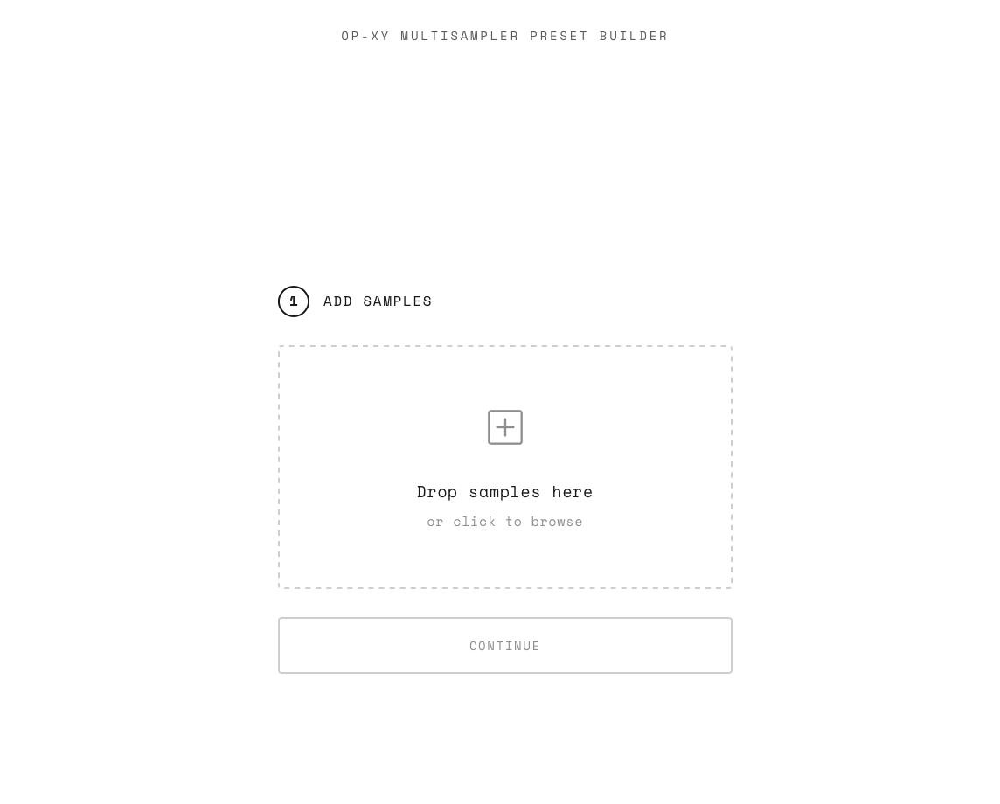
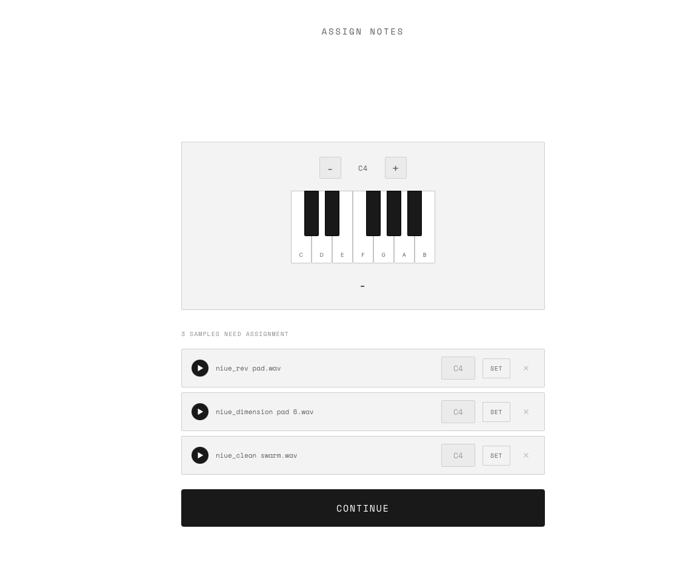

# OP-XY Multisampler Preset Builder

A simple, web-based tool for creating multisampler presets for the Teenage Engineering OP-XY. No installation required — just drag, drop, and download.

**[USE the APP HERE →](https://sixthlaw.github.io/opxy-multisampler-preset-builder/)** 
|
**[Watch the Tutorial →](https://youtu.be/IFNUySQX6XM)**

[](https://sixthlaw.github.io/opxy-multisampler-preset-builder/)

---

## Philosophy

Creating multisampler presets shouldn't be complicated. This tool does the hard work for you:

- **Automatic pitch detection** — Notes are detected from filenames or analyzed from the audio itself
- **Smart defaults** — Sensible settings pre-configured for the OP-XY's native 22kHz sample rate
- **Batch grouping** — Velocity layers and round-robins are automatically detected and split into separate presets
- **Zero configuration** — Just add your samples, name your preset, and download

No DAW required. No manual JSON editing. No command-line tools.

---

## Features

- **Drag & drop import** — WAV, AIFF, MP3, FLAC, and more
- **Intelligent note detection** — Parses filenames (e.g., `Piano-C4.wav`) or analyzes audio pitch
- **Manual assignment** — Interactive keyboard for samples that need help
- **Quality options** — 22kHz (OP-XY native), 44.1kHz, or 48kHz
- **Bit depth** — 16-bit or 24-bit
- **Sample density** — Full, Balanced, or Lite for controlling preset size
- **Velocity/Round-robin grouping** — Automatically detects `_RR1`, `_f`, `_mf`, `_V1` patterns and creates separate presets
- **Dark/Light mode** — Toggle in the top right corner

---

## How It Works

1. **Add Samples** — Drag audio files onto the drop zone
2. **Choose Quality** — Select sample rate and bit depth
3. **Name Your Preset** — Give it a memorable name
4. **Download** — Get a ZIP containing your `.preset` folder

That's it. Copy the `.preset` folder to your OP-XY and you're ready to play.

### Manual Note Assignment

If a sample's pitch can't be automatically detected, you'll see an interactive keyboard to assign notes manually. Play the sample, click the key, done.

[](https://sixthlaw.github.io/opxy-multisampler-preset-builder/)

---

## Installing Presets on OP-XY

1. Unzip the downloaded file
2. Connect your OP-XY via USB and enable disk mode
3. Copy the `.preset` folder(s) to the `presets/` directory
4. Eject the disk safely
5. Your preset will appear in the OP-XY preset browser

---

## Running Locally

If you prefer to run the tool locally:

```bash
# Clone the repository
git clone https://github.com/sixthlaw/opxy-multisampler-preset-builder.git
cd opxy-multisampler-preset-builder

# Install dependencies
npm install

# Start the development server
npm run dev
```

Open `http://localhost:5173` in your browser.

### Building for Production

```bash
npm run build
```

The built files will be in the `dist/` folder, ready to deploy to any static hosting service.

---

## Technical Details

- Built with vanilla JavaScript and Vite
- Uses Web Audio API for high-quality resampling
- Pitch detection via [pitchy](https://github.com/ianprime0509/pitchy) and [pitchfinder](https://github.com/peterkhayes/pitchfinder)
- Generates OP-XY compatible `patch.json` with proper region mapping
- All processing happens in-browser — your samples never leave your device

---

## License

MIT
